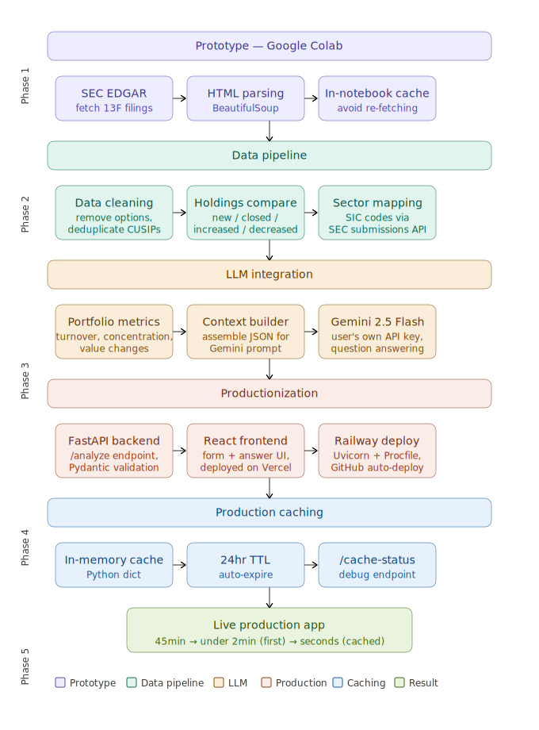

This project automates the analysis of institutional investment activity by building an AI-driven agent that extracts and compares 13F filings from  SEC API. I developed an end-to-end pipeline using Python and FastAPI to process filings, identify new positions, closed investments, and portfolio changes across quarters, and map holdings to sectors using SIC-based classification. The system reduces manual analysis time from 45 to under 2 minutes (for the given company in ipynb file) by transforming raw filings into structured portfolio insights, including turnover, concentration, and sector allocation shifts, accessible through an interactive query interface.

The application is productionized as a full-stack system with a React (JavaScript) frontend and a deployed backend, enabling users to input a company and ask ad-hoc questions about investment behavior. I leveraged Google Gemini 2.5 Flash for cost-efficient LLM integration. The pipeline includes data cleaning, deduplication, and options filtering to ensure accuracy, and is designed to scale as a decision-support tool for investors, analysts, and financial journalists.

